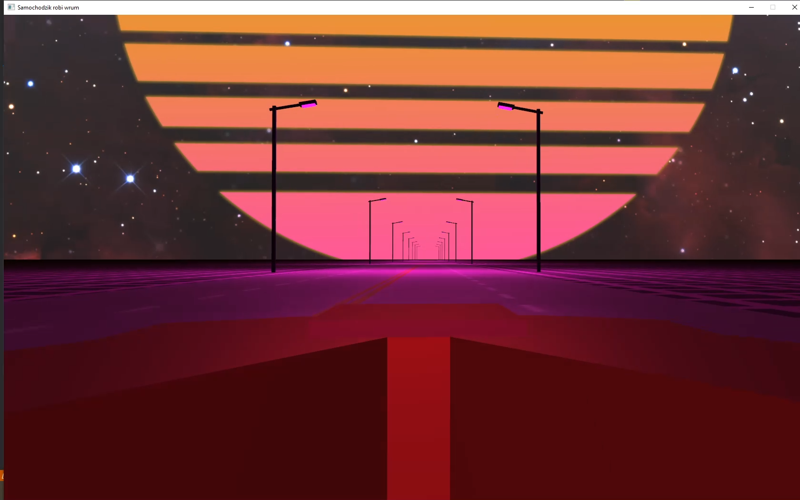
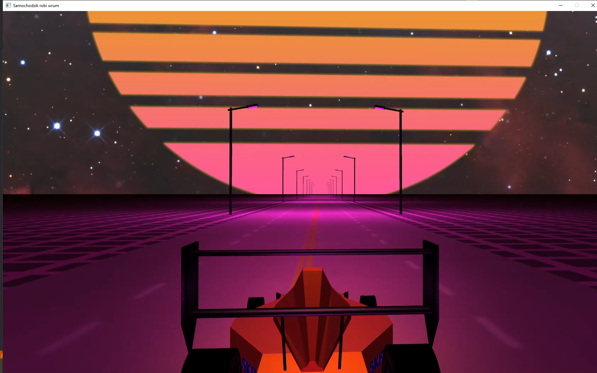

# Authors

| Nick    	    |       Function      |
|--------------------|--------------------|
|DG		|    3D artist/UX    |
|JM 		|     3D artist      |
|KB |     3D artist      |
|BŚ		|Framework/Engine dev|

# **Project Topic**  
Topic: Bolid F1 on track

---

# **Progress**

| Project stage         			            |  Estimated time | Real time | Status |Done                         |
|--------------------------------------------|:------------------:|:--------------:|:------:|:-------------------------------:|
|0. Environment and repository configuration	| 	   	N/A			|       9h       |  Done  | BŚ, JM, KB, DG                  |
|1. Creating a working environment	         | 	   	N/A			|       6,5      |  Done  | KB,                             |
|2. Bolid Modeling				            | 	   	N/A			|       21h      |  Done  | DG, JM                          |
|3. Bolid textures					            | 	   	N/A			|       11h      |  Done  | DG, JM                          |
|4. Track modeling			            | 	   	N/A			|      15,5h     |  Done  | KB                              |
|5. Track textures					               | 	   	N/A			|       2h       |  Done  | KB                              |
|6. Camera tracking the race car      		         | 	   	N/A			|       2h       |  Done  | DG                              |
|7. Lighting 					               | 	   	N/A			|       20h      |  Done  | BŚ                              |
|8. Interactive stage lighting	         | 	   	N/A			|       15m      |  Done  | BŚ                              |
|9. Animation                       	         | 	   	N/A			|       7h       |  Done  | DG, JM                          |
|10. User interaction		         | 	   	N/A			|       4h       |  Done  | BŚ, DG                          |

## **Current version of the program**

	

	

	

# **Teaching materials**
1. https://learnopengl.com/ 
2. https://www.opengl-tutorial.org/
3. https://open.gl/
4. https://www.songho.ca/opengl/index.html
