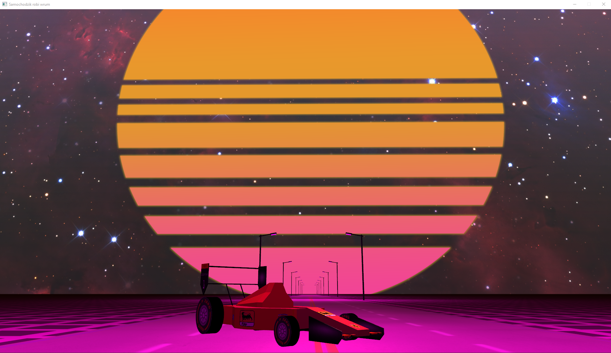

# Autorzy

| Imię i Nazwisko    |       Funkcja      |
|--------------------|--------------------|
|Daniel Górniak		|    3D artist/UX    |
|Jakub Marczuk 		|     3D artist      |
|Konrad Bratosiewicz |     3D artist      |
|Bartosz Świrta		|Framework/Engine dev|

# **Temat projektu**  
Temat: Bolid F1 na torze

---

# **Postępy**

| Etap projektu         			            |  Przewidywany czas | Faktyczny czas | Status |Wykonano                         |
|--------------------------------------------|:------------------:|:--------------:|:------:|:-------------------------------:|
|0. Konfiguracja środowiska i repozytorium	| 	   	N/A			|       9h       |  Done  | KB, BŚ, JM, DG                  |
|1. Utworzenie środowiska roboczego	         | 	   	N/A			|      6,5h      |  Done  | KB,                             |
|2. Modelowanie bolidu				            | 	   	N/A			|       21h      |  Done  | JM, DG                          |
|3. Tekstury bolidu					            | 	   	N/A			|       10h       |  Done  | JM, DG                          |
|4. Model fragmentu toru			            | 	   	N/A			|      15,5h     |  Done  | KB                              |
|5. Tekstury toru					               | 	   	N/A			|       2h       |  Done  | KB                              |
|6. Kamera śledząca bolid      		         | 	   	N/A			|       2h       |  Done  | DG                                |
|7. Oświetlenie 					               | 	   	N/A			|       20h      |  Done  | BŚ                              |
|8. Interaktywne oświetlenie sceny	         | 	   	N/A			|       15m      |  Done  | BŚ                              |
|9. Animacja                       	         | 	   	N/A			|       7h       |  Done  | DG                              |
|10. Interakcja z użytkownikiem		         | 	   	N/A			|                |  Done  |                                 |

## **Aktualna wersja programu**

# **Schemat modeli**

## **Model referencyjny**
W trakcie projektowania modelu bolidu będziemy wzorować się na poniższych zdjęciach.
### FRONT  

### BACK  

### LEFT

### RIGHT

### TOP

# **Milestones**
0. Konfiguracja środowiska i repozytorium GitLab
1. Utworzenie środowiska roboczego
   >a. Implementacja roboczej kamery  
    b. Implementacja roboczego otoczenia
    c. Implementacja prostego obiektu
2. Implementacja modelu bolidu   
	>a. Przygotowanie poszczególnych elementów modelu   
    b. Przygotowanie tekstur  
    c. Teksturowanie modelu 
    d. Scalenie pełnego modelu  
3. Implementacja sceny  
	>a. Implementacja toru  
	 b. Implementacja otoczenia toru    
	 c. Dodanie oświetlenia toru (lampy)  
4. Implementacja regulowanego oświetlenia (interaktywne) 
5. Animacja
6. Implementacja interakcji z użytownikiem
7. Prezentacja gotowego projektu 

# **Etapy projektowe**
 0. Konfiguracja środowiska i repozystorium
 1. Utworzenie środowiska roboczego
    - [x] Implementacja roboczej kamery
    - [x] Implementacja roboczego otoczenia  
	 - [x] Implementacja prostego obiektu  
 2. Modelowanie bolidu
    - [x] Model kół
    - [x] Modele spoilerów  
	 - [x] Model nadwozia  
 3. Tekstury bolidu
    - [x] Tekstury kół
    - [x] Tekstura nadwozia
    - [x] Tekstury elementów aerodynamicznych
 4. Model fragmentu toru 
    - [x] Jezdnia
    - [ ] <s>Trybuny</s>
    - [ ] <s>Bandy (opcjonalnie)</s>
    - [x] Elementy dekoracyjne (opcjonalnie)
 5. Tekstury toru
    - [x] Tekstura jezdni
    - [x] Tekstury elementów dekoracyjnych (opcjonalnie)
 6. Kamera śledząca bolid 
    - [x] Ruch kamery zgodnie z ruchem myszy
	 - [x] Przybliżanie i oddalanie kamery 
 7. Oświetlenie
    - [x] Oświetlenie globalne 
    - [x] Oświetlenie punktowe (lampy)
 8. Interaktywne oświetlenie sceny
 9. Animacja
    - [x] Animacja kół 
 10. Interakcja z użytkownikiem 
	

# **Materiały dydaktyczne**
1. https://learnopengl.com/ 
2. https://www.opengl-tutorial.org/
3. https://open.gl/
4. https://www.songho.ca/opengl/index.html